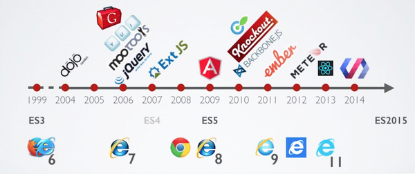
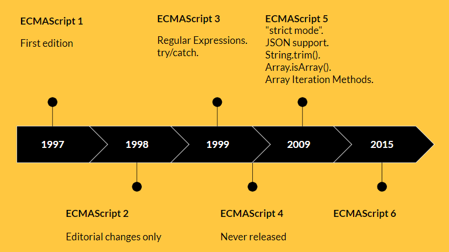

# What's JavaScript ?
 
- JavaScript is a __Programming Language__.
- JavaScript for all __Programming Areas__ (Web / Mobile / Game / IA ...etc).

# What's EcmaScript ?
 
- ECMAScript is a scripting-language specification.
- ECMAScript standardized by Ecma International
- ECMAScript created to standardize JavaScript.

# JavaScript (ES) History 

<!--  -->

# Why JavaScript ⚛️ ?

- We love JavaScript 😍
- Easy to learn 
- Desktop, Web, Mobile and Embedded apps Support
- Flexibility
- Great Developer Tools
- Most Popular

### Any questions 😊?!
